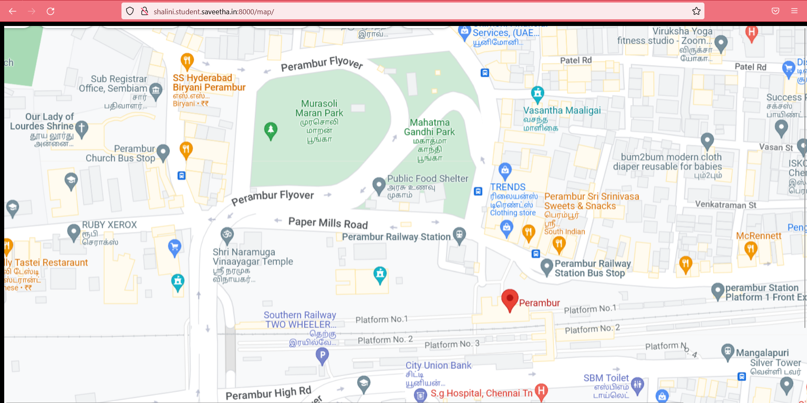
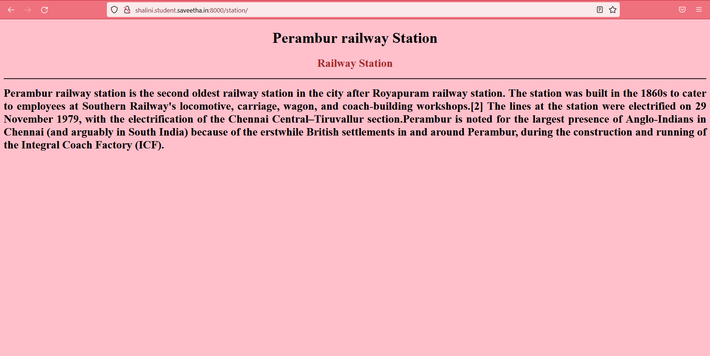
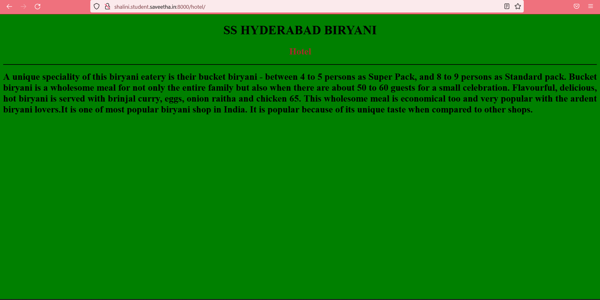
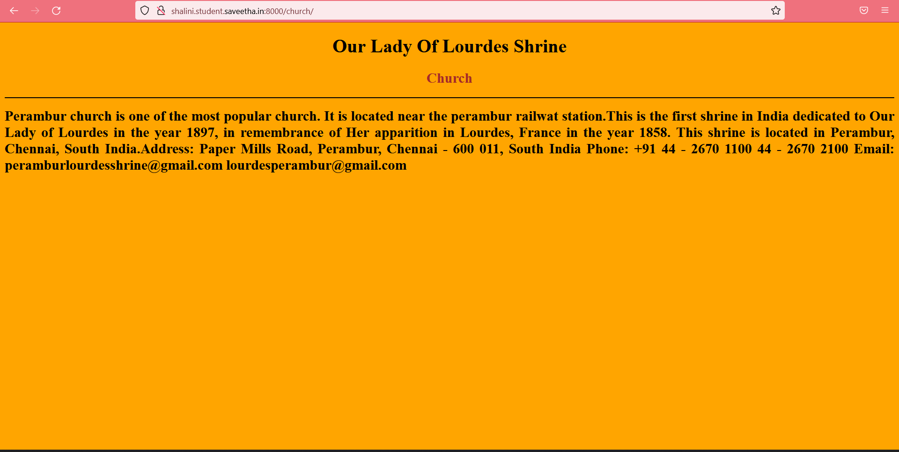
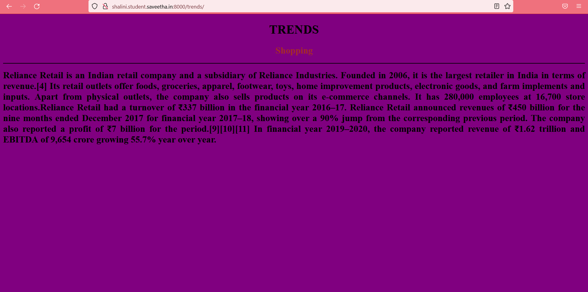
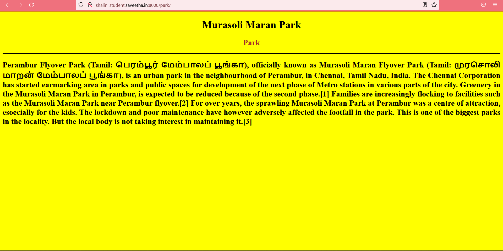
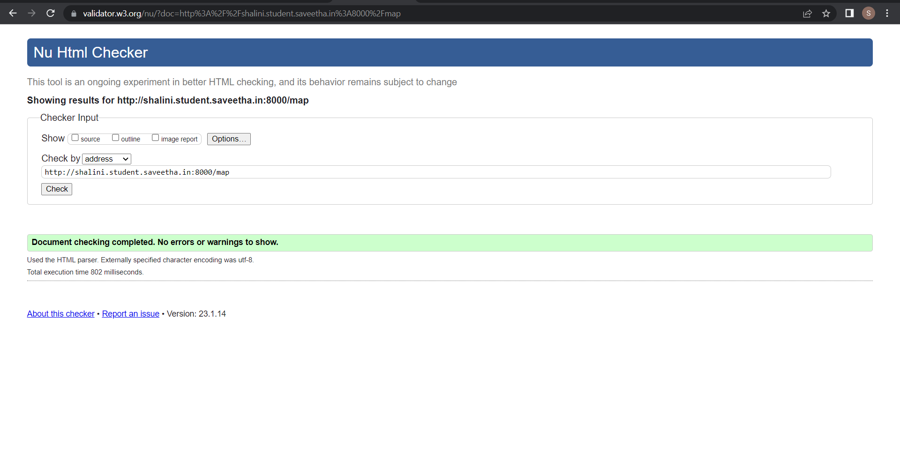

# Places Around Me
## AIM:
To develop a website to display details about the places around my house.

## Design Steps:

### Step 1:
Fork and clone the repository. Create a django project.

### Step 2:
Mark all the places that need to be displayed .

## Code:
```
map.html

<!DOCTYPE html>
<html lang="en">
<head>
<title>My City</title>
</head>

<body style="background-color: black;">
    
<map name="MyCity">
    <area shape="RECT" coords="826,402,903,469" alt="Perambur railway station" title="Perambur railway station" href="/Peramburrailwaystation/">
    <area shape="RECT" coords="333,69,410,162" alt="SS Hyderabad biriyani" title="SS Hyderabad biriyani" href="/SSHyderabadbiriyani/">
    <area shape="RECT" coords="87,182,195,240" alt="church" title="church" href="/church/">
    <area shape="RECT" coords="956,245,1033,325" alt="Trends" title="Trends" href="/Trends/">
    <area shape="RECT" coords="470,110,722,313" alt="Murasoli maran park" title="Murasoli maran park" href="/Murasolimaranpark/">
</map>
</body>
</html>

station.html

<!DOCTYPE html>
<html lang="en">
<head>
<title>STATION</title>
</head>
<body bgcolor="pink">
<h1 align="center">
<font color="black"><b>Perambur railway Station</b></font>
</h1>
<h2 align="center">
<font color="brown"><b>Railway Station</b></font>
</h2>
<hr size="3" color="black">
<p align="justify">
<font face="Times New Roman" size="5">
<b>
    Perambur railway station is the second oldest railway station in the city after Royapuram railway station. The station was built in the 1860s to cater to employees at Southern Railway's locomotive, carriage, wagon, and coach-building workshops.The lines at the station were electrified on 29 November 1979, with the electrification of the Chennai Central–Tiruvallur section.Perambur is noted for the largest presence of Anglo-Indians in Chennai (and arguably in South India) because of the erstwhile British settlements in and around Perambur, during the construction and running of the Integral Coach Factory (ICF).
</b>
</font>
</p>
</body>
</html>

church.html

<!DOCTYPE html>
<html lang="en">
<head>
<title>CHURCH</title>
</head>
<body bgcolor="orange">
<h1 align="center">
<font color="black"><b>Our Lady Of Lourdes Shrine</b></font>
</h1>
<h2 align="center">
<font color="brown"><b>Church</b></font>
</h2>
<hr size="3" color="black">
<p align="justify">
<font face="Times New Roman" size="5">
<b>
    Perambur church is one of the most popular church. It is located near the perambur railwat station.This is the first shrine in India dedicated to Our Lady of Lourdes in the year 1897, in remembrance of Her apparition in Lourdes, France in the year 1858. This shrine is located in Perambur, Chennai, South India.Address:

Paper Mills Road, Perambur,
Chennai - 600 011, South India
Phone:

+91 44 - 2670 1100
44 - 2670 2100
Email:

peramburlourdesshrine@gmail.com lourdesperambur@gmail.com
</b>
</font>
</p>
</body>
</html>

park.html

<!DOCTYPE html>
<html lang="en">
<head>
<title>PARK</title>
</head>
<body bgcolor="yellow">
<h1 align="center">
<font color="black"><b>Murasoli Maran Park</b></font>
</h1>
<h2 align="center">
<font color="brown"><b>Park</b></font>
</h2>
<hr size="3" color="black">
<p align="justify">
<font face="Times New Roman" size="5">
<b>
   Perambur Flyover Park (Tamil: பெரம்பூர் மேம்பாலப் பூங்கா), officially known as Murasoli Maran Flyover Park (Tamil: முரசொலி மாறன் மேம்பாலப் பூங்கா), is an urban park in the neighbourhood of Perambur, in Chennai, Tamil Nadu, India. The Chennai Corporation has started earmarking area in parks and public spaces for development of the next phase of Metro stations in various parts of the city. Greenery in the Murasoli Maran Park in Perambur, is expected to be reduced because of the second phase.[1] Families are increasingly flocking to facilities such as the Murasoli Maran Park near Perambur flyover.[2] For over years, the sprawling Murasoli Maran Park at Perambur was a centre of attraction, esoecially for the kids. The lockdown and poor maintenance have however adversely affected the footfall in the park. This is one of the biggest parks in the locality. But the local body is not taking interest in maintaining it.[3]
</b>
</font>
</p>
</body>
</html>

trends.html

<!DOCTYPE html>
<html lang="en">
<head>
<title>TRENDS</title>
</head>
<body bgcolor="purple">
<h1 align="center">
<font color="black"><b>TRENDS</b></font>
</h1>
<h2 align="center">
<font color="brown"><b>Shopping</b></font>
</h2>
<hr size="3" color="black">
<p align="justify">
<font face="Times New Roman" size="5">
<b>
    Reliance Retail is an Indian retail company and a subsidiary of Reliance Industries. Founded in 2006, it is the largest retailer in India in terms of revenue.[4] Its retail outlets offer foods, groceries, apparel, footwear, toys, home improvement products, electronic goods, and farm implements and inputs. Apart from physical outlets, the company also sells products on its e-commerce channels. It has 280,000 employees at 16,700 store locations.Reliance Retail had a turnover of ₹337 billion in the financial year 2016–17. Reliance Retail announced revenues of ₹450 billion for the nine months ended December 2017 for financial year 2017–18, showing over a 90% jump from the corresponding previous period. The company also reported a profit of ₹7 billion for the period.[9][10][11] In financial year 2019–2020, the company reported revenue of ₹1.62 trillion and EBITDA of 9,654 crore growing 55.7% year over year.
  </b>
</font>
</p>
</body>
</html>

hotel.html

<!DOCTYPE html>
<html lang="en">
<head>
<title>SS HYDERABAD BIRYANI</title>
</head>
<body bgcolor="green">
<h1 align="center">
<font color="black"><b>SS HYDERABAD BIRYANI</b></font>
</h1>
<h2 align="center">
<font color="brown"><b>Hotel</b></font>
</h2>
<hr size="3" color="black">
<p align="justify">
<font face="Times New Roman" size="5">
<b>
    A unique speciality of this biryani eatery is their bucket biryani - between 4 to 5 persons as Super Pack, and 8 to 9 persons as Standard pack. Bucket biryani is a wholesome meal for not only the entire family but also when there are about 50 to 60 guests for a small celebration. Flavourful, delicious, hot biryani is served with brinjal curry, eggs, onion raitha and chicken 65. This wholesome meal is economical too and very popular with the ardent biryani lovers.It is one of most popular biryani shop in India. It is popular because of its unique taste when compared to other shops.
    </b>
</font>
</p>
</body>
</html>

```

## Output:









## Result:

Successfully designed a web page to display the places around me.